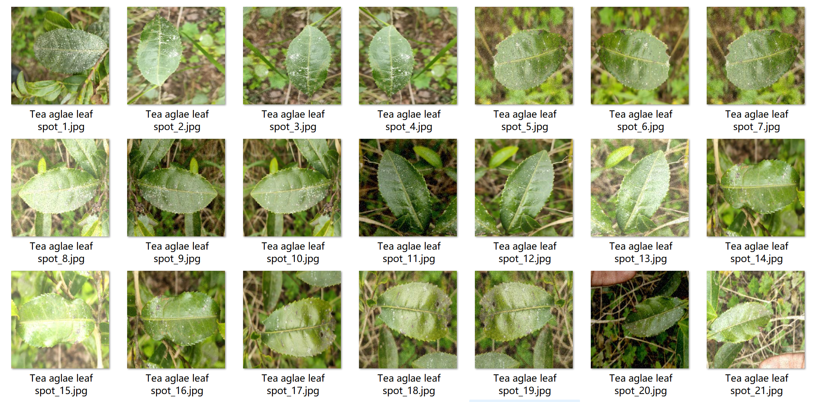
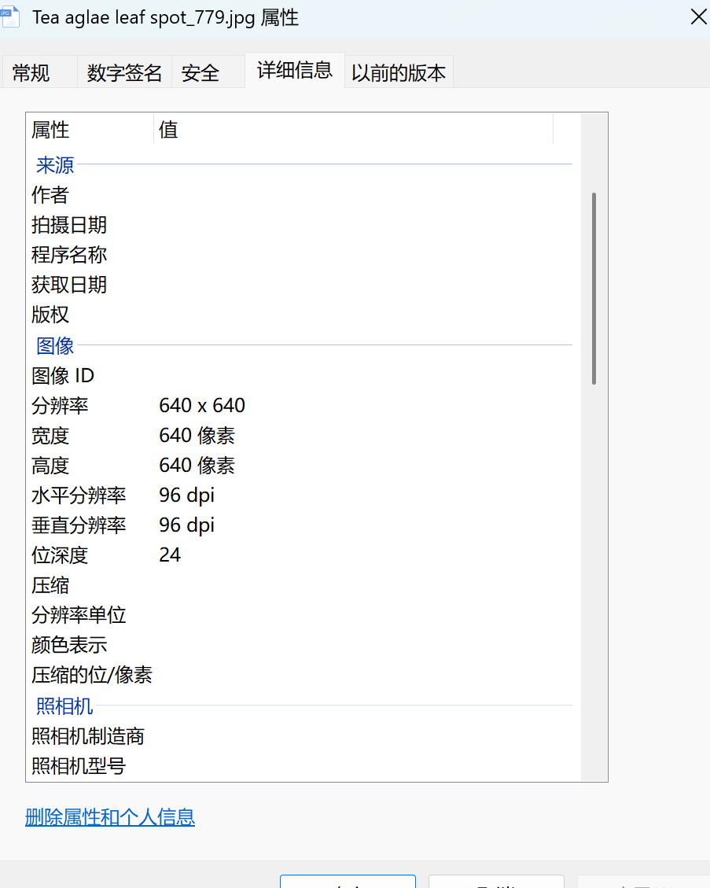
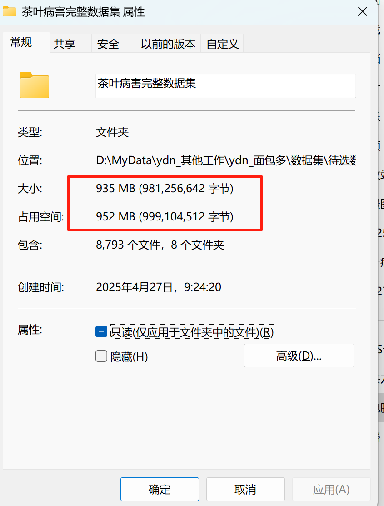

# Tea Leaf Diseases Dataset for Image Classification

Dataset Information:
- Images in the Healthy Leaf folder: 1604
- Images in the Tea Aglae Leaf Spot folder: 1730
- Images in the Tea Bud Blight folder: 1562
- Images in the Tea Cercospora Scab folder: 1339
- Images in the Tea Grey Blight folder: 834
- Images in the Tea Leaf Blight folder: 1718
Total number of images across all subfolders: 8792

Disease Types:
For any inquiries, please direct them directly to me. There is no need for friend verification; you can send messages without my consent. I will be able to see them.
When searching for me, simply send all your questions at once, and I will respond to you. Sometimes I am busy, so please describe your problem and purpose clearly when you contact me.
I will also reply to you when I am free, without any formalities, which will save time.
Phone numbers are also provided above, so if I forget to respond or you wait anxiously, you can text or call.

## Images

Here is a pay link on Stripe ( https://buy.stripe.com/3cs8yP7sY87d0vu9AB ). Please contact me lonlonago@foxmail.com after funding $89, and I will send you a complete data files , thank you!

